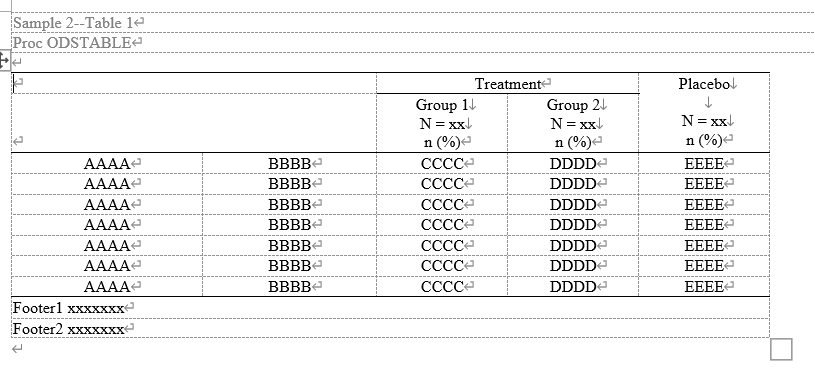
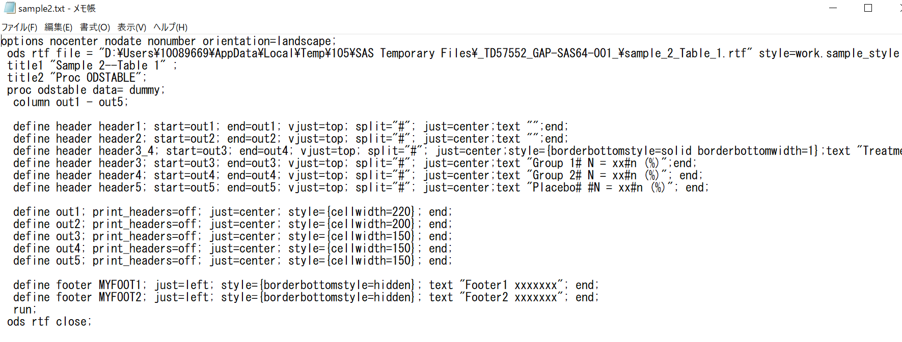
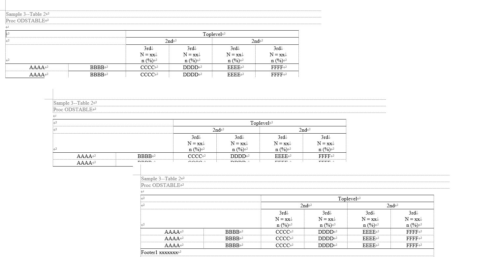
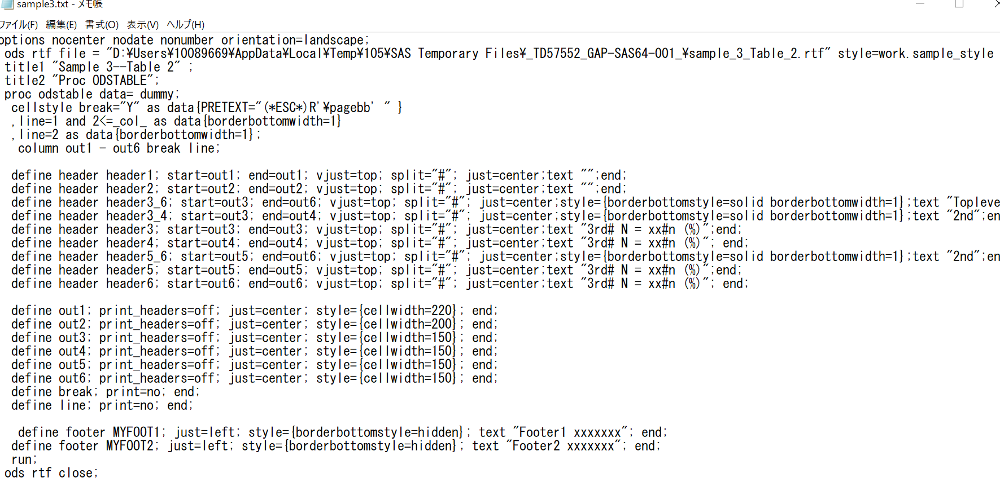
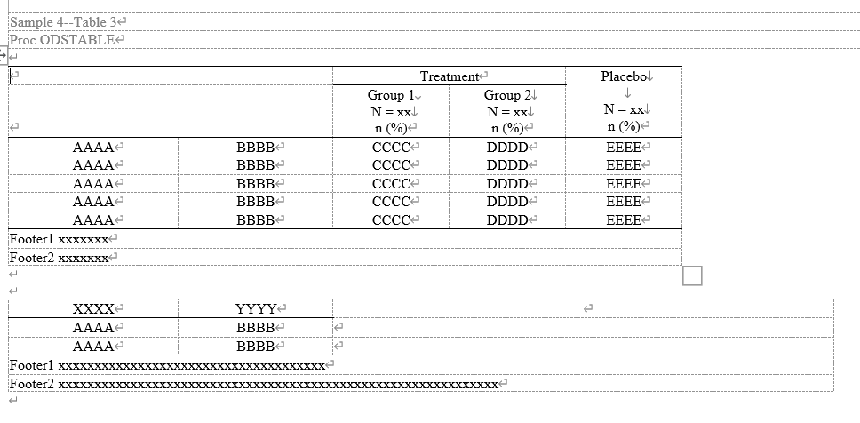
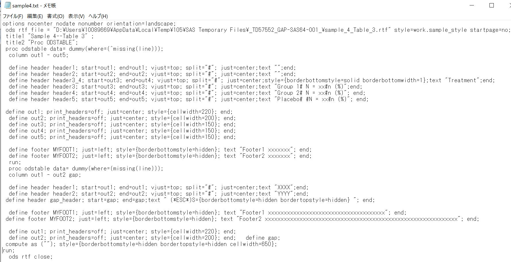

# odstable_layoutshowcase
A SAS macro toolkit to showcase layout patterns using PROC ODSTABLE. Provides reusable examples of table design with multi-level headers, conditional formatting, composite layouts, and auto-generated RTF output. Ideal for clinical reporting, style template development, and training use.

  

# %odstable_layoutshowcase()
 Purpose   : Showcase of PROC ODSTABLE layout patterns with RTF output generator  
             - Generates multi-patterned tables with custom headers/footers  
             - Demonstrates cell merging, grouping, pagination, and style templates  
             - Designed for instructional, reference, and reusable reporting workflows  
 Usage     :  
~~~text
   %odstable_layoutshowcase(outpath=..., sampleno=1~4);
~~~
 Outputs   : 
 ~~~text
   - RTF file(s) with pre-defined table layout samples
   - Corresponding template and macro code as .txt for inspection
~~~
## Useage Example
 ~~~sas
%odstable_layoutshowcase(sampleno=1);
~~~
  
  
 

### Key Features of Sample 1
  Multiple Variables in a Single Cell:  
  When multiple variables are output into the same cell, they are enclosed in parentheses to visually group them together.  
  Line Breaks in Header Labels:  
  Line breaks within header text can be defined using a custom delimiter specified by the split= option (e.g., #), allowing for clean vertical formatting.  
  Hierarchical Header Structure:  
  Header levels are built by stacking multiple define header statements, where each level is defined by its corresponding start= and end= variable range. This approach enables clear and layered multi-row headers.  

    
 ~~~sas
%odstable_layoutshowcase(sampleno=2);
~~~
  

 ~~~sas
%odstable_layoutshowcase(sampleno=3);
~~~
  

### Key Features of Sample 3
  Conditional Styling with cellstyle:  
  Borders can be applied conditionally using syntax like  
  cellstyle condition as data{borderbottomwidth=1}, enabling precise control over table appearance based on data values.  
  Page Breaks via PRETEXT:   
  You can insert page breaks programmatically using PRETEXT="(*ESC*)R'\pagebb'", which outputs an RTF escape sequence before the target cell.  
  Targeting Specific Rows or Columns:  
  The example also demonstrates the use of _row_ and _col_ in condition expressions, showing how to selectively apply styles to specific rows or columns in the table layout.   

 ~~~sas
%odstable_layoutshowcase(sampleno=4);
~~~
  

