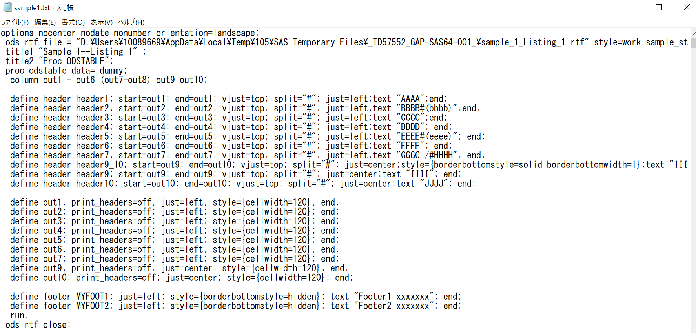
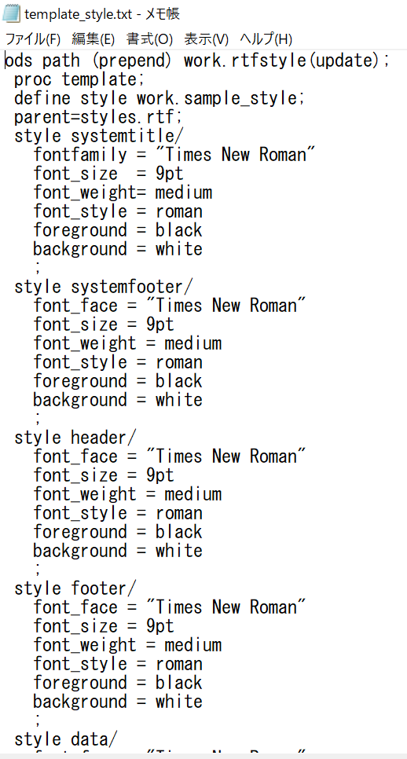
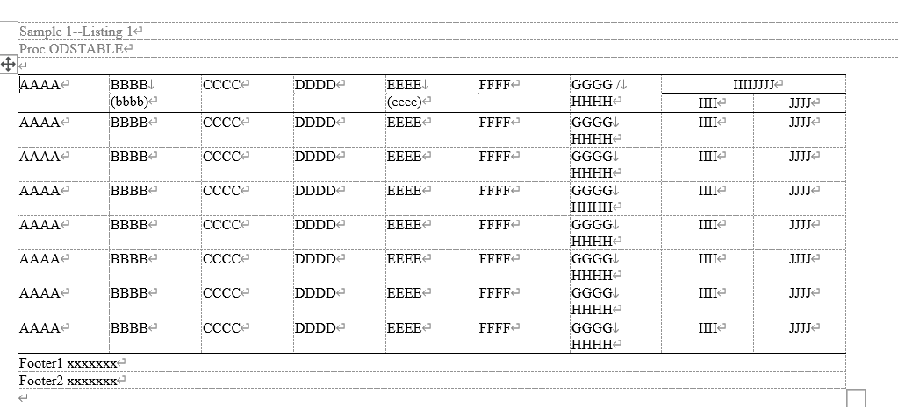

# odstable_layoutshowcase
A SAS macro toolkit to showcase layout patterns using PROC ODSTABLE. Provides reusable examples of table design with multi-level headers, conditional formatting, composite layouts, and auto-generated RTF output. Ideal for clinical reporting, style template development, and training use.

  

# %odstable_layoutshowcase()
 Purpose   : Showcase of PROC ODSTABLE layout patterns with RTF output generator  
             - Generates multi-patterned tables with custom headers/footers  
             - Demonstrates cell merging, grouping, pagination, and style templates  
             - Designed for instructional, reference, and reusable reporting workflows  
 Usage     :  
~~~text
   %odstable_layoutshowcase(outpath=..., sampleno=1~4);
~~~
 Outputs   : 
 ~~~text
   - RTF file(s) with pre-defined table layout samples
   - Corresponding template and macro code as .txt for inspection
~~~
## Useage Example
 ~~~sas
%odstable_layoutshowcase(sampleno=1);
~~~
  
 
  

%odstable_layoutshowcase(sampleno=2);
%odstable_layoutshowcase(sampleno=3);
%odstable_layoutshowcase(sampleno=4);
